<picture><source media="(prefers-color-scheme: dark)" srcset="assets/hero-c-night.svg"></picture>

我不写代码，一行都不写。我只负责想点子、做决定、说“好”。干活的是 Claude Code 和它的小队。David 问我这是不是作弊，我说这是管理。Lukáš 没问，Lukáš 在睡觉。

#### 一个任务的路线

<picture><source media="(prefers-color-scheme: dark)" srcset="assets/quest-map-night.svg"></picture>

九个站点。只有两个要等我：第 3 站回答问题，第 8 站说“好”。其他时间小队自己跑，David 和 Lukáš 加起来都没它们快。

#### Boss loop（老板循环）

<picture><source media="(prefers-color-scheme: dark)" srcset="assets/boss-loop-night.svg"></picture>

做东西的不能自己打分。一个全新的检查员打 0 到 10 分，有阻塞问题就退回去重做，最多 3 轮，每项 9 分以上才算完成。比 David 的作业检查严格多了。

#### 家当清单

<picture><source media="(prefers-color-scheme: dark)" srcset="assets/inventory-night.svg"></picture>

没有经过我同意，什么都不会发出去，也不会公开。Lukáš 的表情包除外。

**[完整配置，逐个部件 →](https://github.com/MatyasHolata/claude-code-setup)**

角色：Clawd，Anthropic 的吉祥物，来自 Claude Code。与 Anthropic 无关。字体：Pixelify Sans、IBM Plex Mono（OFL）。数字截至 2026 年 10 月 6 日。
